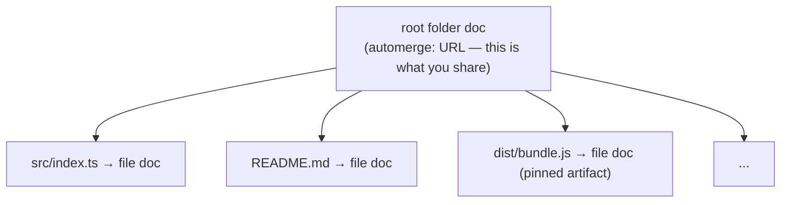
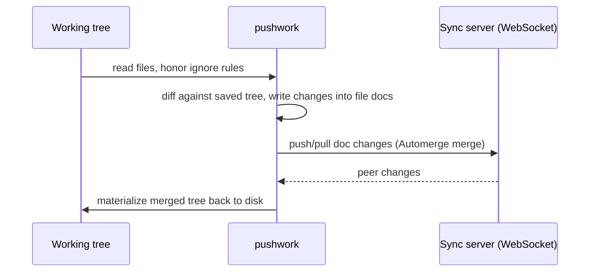

# pushwork

_Bidirectional directory synchronization using [Automerge](https://automerge.org/) CRDTs._

pushwork turns any directory into a synchronized, conflict-free replicated
folder. Initialize a directory to get a shareable `automerge:` URL, hand that
URL to another machine (or another person), and `clone` it. From then on,
`sync` reconciles both working trees through a WebSocket relay — concurrent
edits, additions, deletions, and renames all converge automatically because
every file is backed by an Automerge document.

It feels a bit like Git, but the "merge" is a CRDT: there are no merge
conflicts to resolve by hand, and character-level edits to text files combine
cleanly.

## How it works

A pushwork repo is a tree of Automerge documents. One _root folder doc_ (whose
URL is what you share) references one _file doc_ per file. The folder URL is
stable for the life of the repo, so sharing it once is enough.



A `sync` performs a full round trip:



`save` (alias `commit`) runs the same pipeline _offline_ — it commits to local
CRDT storage and never contacts a server.

## Requirements

- Node.js `>= 24`
- [pnpm](https://pnpm.io/) `>= 8`

## Installation

pushwork is currently built from source:

```sh
git clone <repo-url> pushwork
cd pushwork
pnpm install
pnpm build        # compiles TypeScript to dist/ (required — workers run from dist/)
```

This produces the `pushwork` binary at `dist/cli.js`. You can then either:

```sh
node dist/cli.js <command>      # run directly
pnpm start -- <command>         # via the start script
pnpm link --global              # expose `pushwork` on your PATH
```

The examples below assume `pushwork` is on your PATH.

> [!NOTE]
> A build is required even when developing, because parallel ingest spins up
> worker threads that load compiled scripts from `dist/workers/`.

## Quick start

```sh
# Machine A — turn a directory into a pushwork repo
cd ~/notes
pushwork init
pushwork url            # prints the automerge: URL to share

# Machine B — clone that URL into a new directory
pushwork clone automerge:2sX...e9 ~/notes-clone

# On either machine, after editing files
pushwork sync           # exchange changes with peers and merge to disk

# Inspect local changes before syncing
pushwork status
pushwork diff
```

## Commands

| Command | Description |
|---|---|
| `pushwork init [dir]` | Initialize pushwork in a directory (default `.`). |
| `pushwork clone <url> <dir>` | Clone an `automerge:` URL into a directory. |
| `pushwork sync` | Sync local changes with peers and merge remote changes to disk. |
| `pushwork save` (alias `commit`) | Commit local changes to local storage without contacting the server. |
| `pushwork status` | Show changes against the saved state. |
| `pushwork diff [path]` | Show textual diffs of local changes; optionally limit to `path`. |
| `pushwork url` | Print the `automerge:` URL of this repo. |
| `pushwork heads [pathspec]` | Print Automerge heads for the root folder and every file doc (offline). |
| `pushwork yoink <url> [path]` | Pull a single file doc by URL and write it to disk (default path: the doc's own name). |
| `pushwork yeet <path> <url>` | Push a single file from disk into the file doc at `url`, mutating it in place. |
| `pushwork migrate [dir]` | Upgrade an older `.pushwork/config.json` to the current format. |
| `pushwork cut [name]` | Stash working-tree changes and reset the tree to the saved state (offline). |
| `pushwork paste [id-or-name]` | Re-apply a stashed change set (default: most recent). |
| `pushwork snarfs` (alias `clipboard`) | List stashed change sets, newest first. |
| `pushwork version` | Print pushwork and Automerge package versions. |

### Global options

These apply to every command:

| Flag | Description |
|---|---|
| `--porcelain` | Machine-readable output: tab-separated lines, no spinners/colors/prompts. |
| `-q, --quiet` | Suppress progress; show only results and errors. |
| `--silent` | Suppress all output except errors (check the exit code). |
| `-v, --version` | Print version info and exit. |

### `init` / `clone` options

| Flag | Applies to | Description |
|---|---|---|
| `--shape <shape>` | both | Document shape: `vfs` (default), `patchwork-folder`, or a path to a custom shape module. |
| `--artifact-dir <dir>` | both | Directory stored as immutable, heads-pinned content. Repeatable. Defaults to `dist`. |
| `--no-sub` | both | Use the legacy WebSocket backend instead of Subduction. |
| `--legacy` | both | Alias for `--no-sub`. |

On `clone`, the shape is normally chosen from the root doc itself
(`@patchwork.type` of `directory` → `vfs`, `folder` → `patchwork-folder`);
`--shape` is only the fallback when the type isn't recognized.

### `sync` options

| Flag | Description |
|---|---|
| `--nuclear` | Re-create every file/folder doc with a fresh URL before syncing, dropping references to the old URLs from this repo. |

## Sync backends

pushwork supports two WebSocket sync backends. **Subduction is the default.**

| Backend | Default endpoint | Selected by |
|---|---|---|
| `subduction` | `wss://subduction.sync.inkandswitch.com` | default |
| `legacy` | `wss://sync3.automerge.org` | `--legacy` / `--no-sub` |

Override either endpoint with an environment variable:

```sh
PUSHWORK_SUBDUCTION_SERVER=wss://my-relay.example.com pushwork sync
PUSHWORK_LEGACY_SERVER=wss://my-relay.example.com pushwork sync --legacy
```

## Configuration

pushwork stores all of its metadata under `.pushwork/` at the repo root:

| Path | Contents |
|---|---|
| `.pushwork/config.json` | Repo configuration (see below). |
| `.pushwork/storage/` | Automerge CRDT storage (`NodeFSStorageAdapter`). |
| `.pushwork/snarf/index.json` | Local stash entries (see [Stashing changes](#stashing-changes)). |

`config.json` is currently at version `4`:

```json
{
  "version": 4,
  "rootUrl": "automerge:2sX...e9",
  "backend": "subduction",
  "shape": "vfs",
  "artifactDirectories": ["dist"]
}
```

If the config version doesn't match the installed pushwork, commands fail with
a prompt to run `pushwork migrate`.

### Ignore files

The following are always ignored: `.pushwork`, `.git`, and `node_modules`.
Symlinks are skipped during traversal.

For anything else, add a `.pushworkignore` file at the repo root. It uses
gitignore syntax (blank lines and `#` comments are ignored):

```gitignore
# .pushworkignore
*.log
tmp/
.env
```

### Artifact directories

Files marked as _artifacts_ are treated as build output: their content is
stored as an immutable string and their doc URL is _pinned_ to a specific set
of heads, so consumers reference an exact snapshot rather than a moving target.
By default the `dist` directory is an artifact directory; configure the default
list with `--artifact-dir <dir>` (repeatable) at `init`/`clone` time, which is
recorded in `.pushwork/config.json` (local to your checkout).

#### `.pushworkattributes` (travels with the repo)

`--artifact-dir` only configures _your_ checkout. To make artifact rules travel
with the repo so every collaborator agrees, add a `.pushworkattributes` file at
the repo root. It's an ordinary tracked file (synced like any other content)
modeled on `.gitattributes`, and a sibling to `.pushworkignore`:

```gitattributes
# .pushworkattributes
dist/**     artifact
build/**    artifact
*.wasm      artifact
vendored/   -artifact     # negate a default; last matching rule wins
```

Each line is `<glob> <attr>...` (blank lines and `#` comments ignored).
Patterns are gitignore-style globs; the only attribute today is `artifact`
(`-artifact` unsets it). When a `.pushworkattributes` file is present, its
`artifact` rules **override** `artifactDirectories` from `.pushwork/config.json`,
and pushwork warns when the two disagree so a stale local config can't silently
diverge from the repo.

## Document shapes

A _shape_ controls how the directory tree is encoded into Automerge documents.

| Shape | Value | Structure |
|---|---|---|
| VFS _(default)_ | `vfs` | A single directory doc (`@patchwork.type: "directory"`) whose keys are posix file paths mapping to file-doc URLs. |
| Patchwork folder | `patchwork-folder` | A recursive folder-of-docs (`@patchwork.type: "folder"`) compatible with Patchwork and original pushwork repos. |
| Custom | _module path_ | A module with a `default` export implementing `{ encode, decode }`. |

Select a shape with `--shape` at `init`/`clone`.

## Stashing changes

pushwork has a local "clipboard" for working-tree changes — handy for setting
aside in-progress edits. These stashes (called _snarfs_) are stored locally and
are never synced.

```sh
pushwork cut "wip-refactor"   # stash changes, reset tree to saved state
pushwork snarfs               # list stashes (newest first)
pushwork paste                # re-apply the most recent stash
pushwork paste wip-refactor   # or re-apply a specific one by id or name
```

## Sharing a single file

`yoink` and `yeet` move one file doc around by URL, independent of any folder
structure. Find a file's doc URL with `heads`, then pull or push it from
anywhere:

```sh
pushwork heads notes/todo.md        # → notes/todo.md  automerge:abcd…  <heads>
pushwork yoink automerge:abcd        # write that doc to ./todo.md (its own name)
pushwork yoink automerge:abcd grabbed.md   # …or to an explicit path
pushwork yeet draft.md automerge:abcd      # overwrite the doc with draft.md
```

Both run inside an initialized repo (they use its backend and storage) and
contact the sync server. `yoink` is detached: the file it writes is an
ordinary working-tree file, not linked back to the source doc — a later `save`
or `sync` tracks it under a fresh file doc like any other path. `yeet` mutates
the target doc in place (text merges character-by-character; binary is
last-writer-wins), so peers holding that URL see the change.

## Migrating older repos

If you have a repo created by an older pushwork (or the original pushwork
"main" repo with a `.pushwork/config.json` predating versioning), upgrade it
in place:

```sh
pushwork migrate          # operates on the current directory
pushwork migrate ./repo
```

Migration walks the config forward one version at a time and reports the steps
taken, or that the repo is already up to date.

## Programmatic API

The package also exposes a library API (`import` from `pushwork`). Functions
that talk to the network accept `online: false` for fully offline operation.

```ts
import { init, clone, sync, save, status } from "pushwork";

// Initialize a repo
const { url, files } = await init({
  dir: "./my-project",
  backend: "subduction",   // or "legacy"
  shape: "vfs",
});
console.log(`Initialized ${files} files at ${url}`);

// Clone it elsewhere
await clone({ url, dir: "./clone-target", backend: "subduction", shape: "vfs" });

// Sync / inspect
await sync("./my-project");           // online by default
await save("./my-project");           // offline commit
const { diff } = await status("./my-project");
```

### Exported functions

| Function | Signature |
|---|---|
| `init` | `(opts: InitOpts, report?: Reporter) => Promise<RepoSummary>` |
| `clone` | `(opts: CloneOpts, report?: Reporter) => Promise<RepoSummary>` |
| `sync` | `(cwd: string, opts?: { nuclear?: boolean }, report?: Reporter) => Promise<void>` |
| `save` | `(cwd: string, report?: Reporter) => Promise<void>` |
| `status` | `(cwd: string) => Promise<{ diff: Diff }>` |
| `diff` | `(cwd: string, limitToPath?: string) => Promise<Array<{ path; kind; before?; after? }>>` |
| `url` | `(cwd: string) => Promise<AutomergeUrl>` |
| `heads` | `(cwd: string, pathspec?: string) => Promise<HeadsEntry[]>` |
| `cutWorkdir` | `(cwd: string, opts?: { name?: string }) => Promise<{ id; entries }>` |
| `pasteSnarf` | `(cwd: string, selector?: string) => Promise<{ id; entries; name? }>` |
| `showSnarfs` | `(cwd: string) => Promise<Snarf[]>` |
| `nuclearizeRepo` | `(cwd: string) => Promise<void>` |

Configuration and migration helpers (`migrate`, `migrations`, `detectVersion`,
`readRawConfig`, `CONFIG_VERSION`) and shape helpers (`vfsShape`,
`patchworkFolderShape`, `pinUrl`, `stripHeads`, `isInArtifactDir`,
`normalizeArtifactDir`) are exported as well.

Key option types:

```ts
type Backend = "legacy" | "subduction";

type InitOpts = {
  dir: string;
  backend: Backend;
  shape: string;                       // "vfs" | "patchwork-folder" | module path
  artifactDirectories?: readonly string[];   // default: ["dist"]
  online?: boolean;                    // default: true
};

type CloneOpts = InitOpts & {
  url: string;
  // optional interactive hooks for legacy "branches" / strategy docs:
  onBranchesDoc?: (info) => AutomergeUrl | Promise<AutomergeUrl>;
  onStrategyDoc?: (info) => boolean | Promise<boolean>;
};
```

## Environment variables

| Variable | Default | Purpose |
|---|---|---|
| `PUSHWORK_SUBDUCTION_SERVER` | `wss://subduction.sync.inkandswitch.com` | Subduction sync endpoint. |
| `PUSHWORK_LEGACY_SERVER` | `wss://sync3.automerge.org` | Legacy WebSocket sync endpoint. |
| `PUSHWORK_PARALLEL_INGEST` | adaptive | `shard`/`2` forces worker pools on; `off`/`0` forces them off. |
| `PUSHWORK_WORKERS` | `8` | Maximum worker-pool size for parallel ingest/clone. |
| `DEBUG` | _off_ | Set `DEBUG=true` (rewritten to `DEBUG=*`) to enable `pushwork:*` debug logs. |

### Parallel ingest

For large trees, pushwork shards file ingest (push) and clone (pull) across
worker threads, each owning its own Automerge `Repo` over the shared
`.pushwork/storage`. Sharding kicks in automatically at roughly 8+ files and
falls back to the main thread on any per-worker failure. Tune or disable it
with `PUSHWORK_PARALLEL_INGEST` and `PUSHWORK_WORKERS`.

## Development

| Script | Description |
|---|---|
| `pnpm build` | Compile TypeScript to `dist/`. |
| `pnpm dev` | `tsc --watch`. |
| `pnpm test` | Run the Vitest suite. |
| `pnpm test:watch` / `pnpm test:coverage` | Watch / coverage modes. |
| `pnpm typecheck` | `tsc --noEmit`. |
| `pnpm lint` / `pnpm lint:fix` | ESLint over `src`. |
| `pnpm bench` | Build and run the sync benchmark harness. |

```sh
# Example benchmark runs
npx tsx bench/sync-bench.ts --files 2000 --size 512 --text 1 --fanout 20
npx tsx bench/sync-bench.ts --clone-local --files 3000
```

## License

MIT © Ink & Switch
