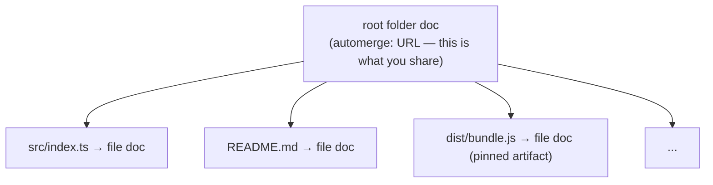
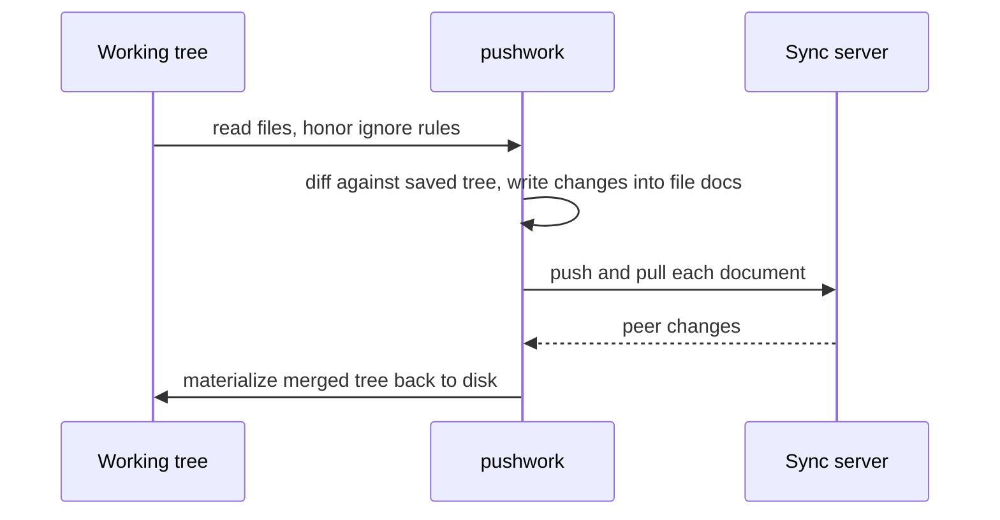

# pushwork

_Bidirectional directory synchronization using [Automerge](https://automerge.org/) CRDTs._

pushwork turns any directory into a synchronized, conflict-free replicated folder. Initialize a directory to get a shareable `automerge:` URL, hand that URL to another machine (or another person), and `clone` it. From then on, `sync` reconciles both working trees through a WebSocket relay — concurrent edits, additions, deletions, and renames all converge automatically because every file is backed by an Automerge document.

It feels a bit like Git, but the "merge" is a CRDT: there are no merge conflicts to resolve by hand, and character-level edits to text files combine cleanly.

## Requirements

- Node.js `>= 24`
- [pnpm](https://pnpm.io/) `>= 8`

## Installation

### From npm (recommended)

```sh
npm install --global pushwork
# or run it without installing:
npx pushwork <command>
```

This puts `pushwork` on your PATH. The examples below assume that.

### From source

```sh
git clone <repo-url> pushwork
cd pushwork
pnpm install
pnpm build        # compiles TypeScript to dist/
```

This produces the `pushwork` binary at `dist/cli.js`. You can then either:

```sh
node dist/cli.js <command>      # run directly
pnpm start -- <command>         # via the start script
pnpm link --global              # expose `pushwork` on your PATH
```

> [!NOTE]
>
> The compiled `dist/` is what the CLI runs (and what the tests exercise), so build before running from source.

## Quick start

```sh
# Machine A — turn a directory into a pushwork repo
cd ~/notes
pushwork init
pushwork url            # prints the automerge: URL to share

# Machine B — clone that URL into a new directory
pushwork clone automerge:2sX...e9 ~/notes-clone

# On either machine, after editing files
pushwork sync           # exchange changes with peers and merge to disk

# Inspect local changes before syncing
pushwork status
pushwork diff
```

## Commands

| Command | Description |
| --- | --- |
| `pushwork init [dir]` | Initialize pushwork in a directory (default `.`). |
| `pushwork clone <url> <dir>` | Clone an `automerge:` URL into a directory. |
| `pushwork sync` | Sync local changes with peers and merge remote changes to disk. |
| `pushwork save` (alias `commit`) | Commit local changes to local storage without contacting the server. |
| `pushwork status` | Show changes against the saved state. |
| `pushwork diff [path]` | Show textual diffs of local changes; optionally limit to `path`. |
| `pushwork url` | Print the `automerge:` URL of this repo. |
| `pushwork heads [pathspec]` | Print Automerge heads for the root folder and every file doc (offline). |
| `pushwork yoink <url> [path]` | Pull a single file doc by URL and write it to disk (default path: the doc's own name). |
| `pushwork yeet <path> <url>` | Push a single file from disk into the file doc at `url`, mutating it in place. |
| `pushwork cut [name]` | Stash working-tree changes and reset the tree to the saved state (offline). |
| `pushwork paste [id-or-name]` | Re-apply a stashed change set (default: most recent). |
| `pushwork snarfs` (alias `clipboard`) | List stashed change sets, newest first. |
| `pushwork version` | Print pushwork and Automerge package versions. |

### Global options

These apply to every command:

| Flag | Description |
| --- | --- |
| `--porcelain` | Machine-readable output: tab-separated lines, no spinners/colors/prompts. |
| `-q, --quiet` | Suppress progress; show only results and errors. |
| `--silent` | Suppress all output except errors (check the exit code). |
| `-v, --version` | Print version info and exit. |

### `init` / `clone` options

| Flag | Applies to | Description |
| --- | --- | --- |
| `--shape <shape>` | both | Document shape: `vfs` (default), `patchwork-folder`, or a path to a custom shape module. |
| `--artifact-dir <dir>` | both | Directory stored as immutable, heads-pinned content. Repeatable. Defaults to `dist`. |
| `--server <url>` | both | Sync server for this repo, saved in its config. Defaults to `wss://subduction.sync.inkandswitch.com`. |
| `--offline` | init | Create the repo without contacting the server. The next `sync` publishes it. |
| `--publish` | init | Make a tree everyone can read and only you can write (see [Publishing](#publishing)). |

On `clone`, the shape is normally chosen from the root doc itself (`@patchwork.type` of `directory` → `vfs`, `folder` → `patchwork-folder`); `--shape` is only the fallback when the type isn't recognized.

### `sync` options

| Flag | Description |
| --- | --- |
| `--nuclear` | Re-create every file/folder doc with a fresh URL before syncing, dropping references to the old URLs from this repo. |

`sync` ends with one of three verdicts:

| Verdict | Meaning |
| --- | --- |
| `SYNCED` | The server has every document in the tree, and you have everything it has. |
| `PENDING` | Some documents weren't confirmed by the server (`--porcelain` lists them). The next `sync` retries them. |
| `OFFLINE` | The server couldn't be reached. Local changes are saved and go out on the next `sync`. |

## Publishing

`pushwork init --publish` creates a tree that anyone with the URL can clone and read, but only you can change. Its documents are protected with [keyhive](https://github.com/inkandswitch/keyhive), and the server refuses writes from anyone else. A clone of a published tree is read-only: `sync` pulls, and refuses to run while you have local edits (`pushwork cut` them first).

Your signing key is `~/.pushwork/key` and your keyhive state is `~/.pushwork/keyhive`, both shared by every repo on the machine. Keep them; they are the only thing that can write to trees you publish. One pushwork command at a time can change the keyhive state: a second `sync`, `save`, `init` or `clone` of a published tree, in any repo, stops with an error naming the first. `status`, `diff`, `heads`, `cut` and `paste` only read it. Published trees sync through `wss://keyhive.sync.automerge.org`, which speaks keyhive, so `--publish` can't be combined with `--server`.

## Configuration

pushwork stores all of its metadata under `.pushwork/` at the repo root:

| Path | Contents |
| --- | --- |
| `.pushwork/config.json` | Repo configuration (see below). |
| `.pushwork/storage/` | Document storage, in the same layout as Subduction's Rust filesystem storage. |
| `.pushwork/snarf/index.json` | Local stash entries (see [Stashing changes](#stashing-changes)). |

`config.json` is at version `6`:

```json
{
	"version": 6,
	"rootUrl": "automerge:2sX...e9",
	"shape": "vfs",
	"artifactDirectories": ["dist"],
	"server": "ws://localhost:8080"
}
```

`server` is present only when the repo was created with `--server`. A tree made with `init --publish` also has `publishGroup`, the keyhive group its documents belong to.

### Ignore files

The following are always ignored: `.pushwork`, `.git`, and `node_modules`. Symlinks are skipped during traversal.

For anything else, add a `.pushworkignore` file at the repo root. It uses gitignore syntax (blank lines and `#` comments are ignored):

```gitignore
# .pushworkignore
*.log
tmp/
.env
```

### Artifact directories

Files marked as _artifacts_ are treated as build output: their content is stored as an immutable string and their doc URL is _pinned_ to a specific set of heads, so consumers reference an exact snapshot rather than a moving target. By default the `dist` directory is an artifact directory; configure the default list with `--artifact-dir <dir>` (repeatable) at `init`/`clone` time, which is recorded in `.pushwork/config.json` (local to your checkout).

#### `.pushworkattributes` (travels with the repo)

`--artifact-dir` only configures _your_ checkout. To make artifact rules travel with the repo so every collaborator agrees, add a `.pushworkattributes` file at the repo root. It's an ordinary tracked file (synced like any other content) modeled on `.gitattributes`, and a sibling to `.pushworkignore`:

```gitattributes
# .pushworkattributes
dist/**     artifact
build/**    artifact
*.wasm      artifact
vendored/   -artifact     # negate a default; last matching rule wins
```

Each line is `<glob> <attr>...` (blank lines and `#` comments ignored). Patterns are gitignore-style globs; the only attribute today is `artifact` (`-artifact` unsets it). When a `.pushworkattributes` file is present, its `artifact` rules **override** `artifactDirectories` from `.pushwork/config.json`, and pushwork warns when the two disagree so a stale local config can't silently diverge from the repo.

## Document shapes

A _shape_ controls how the directory tree is encoded into Automerge documents.

| Shape | Value | Structure |
| --- | --- | --- |
| VFS _(default)_ | `vfs` | A single directory doc (`@patchwork.type: "directory"`) whose keys are posix file paths mapping to file-doc URLs. |
| Patchwork folder | `patchwork-folder` | A recursive folder-of-docs (`@patchwork.type: "folder"`) compatible with Patchwork and original pushwork repos. |
| Custom | _module path_ | A module with a `default` export implementing `{ encode, decode }`. |

Select a shape with `--shape` at `init`/`clone`.

## Stashing changes

pushwork has a local "clipboard" for working-tree changes — handy for setting aside in-progress edits. These stashes (called _snarfs_) are stored locally and are never synced.

```sh
pushwork cut "wip-refactor"   # stash changes, reset tree to saved state
pushwork snarfs               # list stashes (newest first)
pushwork paste                # re-apply the most recent stash
pushwork paste wip-refactor   # or re-apply a specific one by id or name
```

## Sharing a single file

`yoink` and `yeet` move one file doc around by URL, independent of any folder structure. Find a file's doc URL with `heads`, then pull or push it from anywhere:

```sh
pushwork heads notes/todo.md        # → notes/todo.md  automerge:abcd…  <heads>
pushwork yoink automerge:abcd        # write that doc to ./todo.md (its own name)
pushwork yoink automerge:abcd grabbed.md   # …or to an explicit path
pushwork yeet draft.md automerge:abcd      # overwrite the doc with draft.md
```

Both work anywhere and contact the sync server. Inside a repo they use its server, but they never keep anything in local storage. `yoink` is detached: the file it writes is an ordinary working-tree file, not linked back to the source doc — a later `save` or `sync` tracks it under a fresh file doc like any other path. `yeet` mutates the target doc in place (text merges character-by-character; binary is last-writer-wins), so peers holding that URL see the change.

## How it works

A pushwork repo is a tree of Automerge documents. One _root folder doc_ (whose URL is what you share) references one _file doc_ per file. The folder URL is stable for the life of the repo, so sharing it once is enough.


```mermaid
graph TD
    A["root folder doc<br/>(automerge: URL — this is what you share)"]
    A --> B["src/index.ts → file doc"]
    A --> C["README.md → file doc"]
    A --> D["dist/bundle.js → file doc (pinned artifact)"]
    A --> E["..."]
```

A `sync` performs a full round trip:


```mermaid
sequenceDiagram
    participant FS as Working tree
    participant PW as pushwork
    participant SRV as Sync server
    FS->>PW: read files, honor ignore rules
    PW->>PW: diff against saved tree, write changes into file docs
    PW->>SRV: push and pull each document
    SRV-->>PW: peer changes
    PW->>FS: materialize merged tree back to disk
```

`save` (alias `commit`) runs the same pipeline _offline_ — it commits to local storage and never contacts a server.

Each document is stored as a sedimentree: loose commits plus fragments that bundle runs of history. At the end of every command pushwork compacts the documents it changed, so old loose commits on disk are replaced by the fragments that cover them.

## Upgrading from pushwork 2

pushwork 3 uses a new storage format and doesn't read pushwork 2 repos. In an old repo, run `npx pushwork@2 sync` to publish any local edits, then clone it fresh:

```sh
pushwork clone <rootUrl> <newdir> --shape <shape>
```

Running pushwork 3 in an old repo prints this command with the right URL and shape filled in. Repos on the retired sync3 server can't be cloned; `rm -rf .pushwork && pushwork init` republishes the directory as a new repo.

## Programmatic API

The package also exposes a library API (`import` from `pushwork`).

```ts
import {init, clone, sync, save, status} from "pushwork"

const {url, files} = await init({dir: "./my-project", shape: "vfs"})
console.log(`Initialized ${files} files at ${url}`)

await clone({url, dir: "./clone-target", shape: "vfs"})

const report = await sync("./my-project") // { online, synced, unsynced, url, heads, ... }
await save("./my-project") // offline commit
const {diff} = await status("./my-project")
```

### Exported functions

| Function | Signature |
| --- | --- |
| `init` | `(opts: InitOpts, report?: Reporter, warn?: Warn) => Promise<RepoSummary>` |
| `clone` | `(opts: CloneOpts, report?: Reporter) => Promise<RepoSummary>` |
| `sync` | `(cwd: string, opts?: { nuclear?: boolean }, report?: Reporter, warn?: Warn) => Promise<SyncSummary>` |
| `save` | `(cwd: string, report?: Reporter, warn?: Warn) => Promise<void>` |
| `status` | `(cwd: string) => Promise<{ diff: Diff }>` |
| `diff` | `(cwd: string, limitToPath?: string) => Promise<Change[]>` |
| `url` | `(cwd: string) => Promise<AutomergeUrl>` |
| `heads` | `(cwd: string, pathspec?: string) => Promise<HeadsEntry[]>` |
| `cutWorkdir` | `(cwd: string, opts?: { name?: string }) => Promise<{ id; entries }>` |
| `pasteSnarf` | `(cwd: string, selector?: string) => Promise<{ id; entries; name? }>` |
| `showSnarfs` | `(cwd: string) => Promise<Snarf[]>` |
| `nuclearizeRepo` | `(cwd: string, warn?: Warn) => Promise<void>` |

Also exported: the URL helpers (`parseAutomergeUrl`, `stringifyAutomergeUrl`, `isValidAutomergeUrl`, `stripHeads`), the shapes (`vfsShape`, `patchworkFolderShape`, `isInArtifactDir`, `normalizeArtifactDir`), `readAttributes`, `CONFIG_VERSION` and `DEFAULT_SERVER`.

```ts
type InitOpts = {
	dir: string
	shape: string // "vfs" | "patchwork-folder" | module path
	artifactDirectories?: readonly string[] // default: ["dist"]
	online?: boolean // default: true
	server?: string // default: DEFAULT_SERVER
	publish?: boolean // see Publishing; can't be combined with server
}

type CloneOpts = {
	url: string
	dir: string
	shape: string // used when the root doc's type isn't recognized
	artifactDirectories?: readonly string[]
	server?: string
	onStrategyDoc?: (info) => boolean | Promise<boolean> // run the root's .pushworkStrategy?
}

type SyncSummary = {
	online: boolean
	error?: string // why the connection failed
	connectMs?: number
	synced: number
	unsynced: AutomergeUrl[]
	url: AutomergeUrl // the root
	heads: string[]
}
```

## Debugging

Set `DEBUG=pushwork:*` for pushwork's debug log (`DEBUG=true` turns on everything). Subduction's own log stays at errors only unless `DEBUG` mentions `subduction`.

## Development

| Script | Description |
| --- | --- |
| `pnpm build` | Compile TypeScript to `dist/`. |
| `pnpm dev` | `tsc --watch`. |
| `pnpm test` | Run the Vitest suite against a local test server. |
| `pnpm test:network` | Run the tests in `test/network/` against the real servers: the default server and, for publishing, the keyhive server. |
| `pnpm test:watch` / `pnpm test:coverage` | Watch / coverage modes. |
| `pnpm typecheck` | `tsc --noEmit`. |
| `pnpm lint` / `pnpm lint:fix` | ESLint over `src`. |
| `pnpm bench` | Build and run the sync benchmark harness. |

```sh
pnpm bench:build
node dist-bench/bench/sync-bench.js --files 2000 --size 512 --text 1 --fanout 20
node dist-bench/bench/sync-bench.js --clone-local --files 3000
node dist-bench/bench/incremental-bench.js --files 2000
```

## Design

The [`design/`](./design/) directory documents how pushwork works under the hood: [document shapes](./design/shapes.md), [sync](./design/sync.md), [artifact directories](./design/artifacts.md), [config](./design/config.md), and [snarfs](./design/snarf.md).

## Contributing

See [CONTRIBUTING.md](./CONTRIBUTING.md). This project follows a [code of conduct](./CODE_OF_CONDUCT.md).

## License

Licensed under either of:

- Apache License, Version 2.0 ([LICENSE-APACHE](./LICENSE-APACHE) or <http://www.apache.org/licenses/LICENSE-2.0>)
- MIT license ([LICENSE-MIT](./LICENSE-MIT) or <http://opensource.org/licenses/MIT>)

at your option.

Unless you explicitly state otherwise, any contribution intentionally submitted for inclusion in the work by you, as defined in the Apache-2.0 license, shall be dual licensed as above, without any additional terms or conditions.

© Ink & Switch
