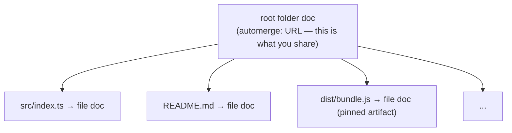
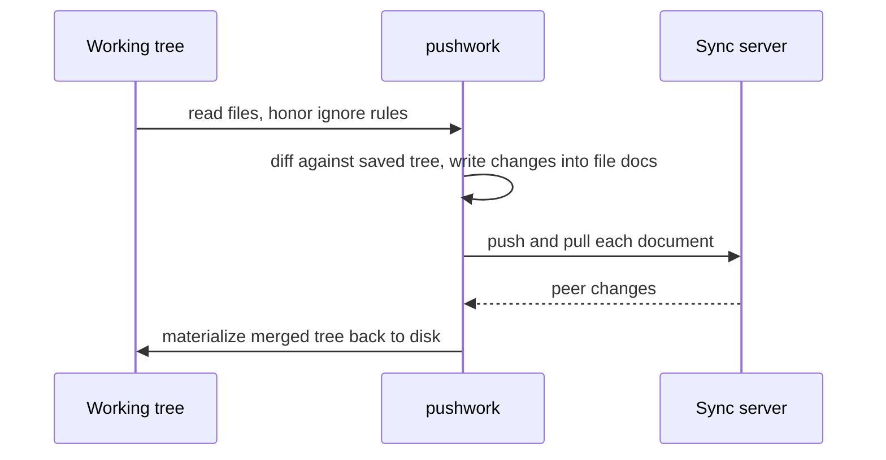

# pushwork

_Bidirectional directory synchronization using [Automerge](https://automerge.org/) CRDTs._

pushwork turns any directory into a synchronized, conflict-free replicated folder. Initialize a directory to get a shareable `automerge:` URL, hand that URL to another machine (or another person), and `clone` it. From then on, `sync` reconciles both working trees through a WebSocket relay — concurrent edits, additions, deletions, and renames all converge automatically because every file is backed by an Automerge document.

It feels a bit like Git, but the "merge" is a CRDT: there are no merge conflicts to resolve by hand, and character-level edits to text files combine cleanly.

## Requirements

- Node.js `>= 24`
- [pnpm](https://pnpm.io/) `>= 8`

## Installation

### From npm (recommended)

```sh
npm install --global pushwork
# or run it without installing:
npx pushwork <command>
```

This puts `pushwork` on your PATH. The examples below assume that.

### From source

```sh
git clone <repo-url> pushwork
cd pushwork
pnpm install
pnpm build        # compiles TypeScript to dist/
```

This produces the `pushwork` binary at `dist/cli.js`. You can then either:

```sh
node dist/cli.js <command>      # run directly
pnpm start -- <command>         # via the start script
pnpm link --global              # expose `pushwork` on your PATH
```

> [!NOTE]
>
> The compiled `dist/` is what the CLI runs (and what the tests exercise), so build before running from source.

## Quick start

```sh
# Machine A — turn a directory into a pushwork repo
cd ~/notes
pushwork init
pushwork url            # prints the automerge: URL to share

# Machine B — clone that URL into a new directory
pushwork clone automerge:2sX...e9 ~/notes-clone

# On either machine, after editing files
pushwork sync           # exchange changes with peers and merge to disk

# Inspect local changes before syncing
pushwork status
pushwork diff
```

## Commands

| Command | Description |
| --- | --- |
| `pushwork init [dir]` | Initialize pushwork in a directory (default `.`). |
| `pushwork clone <url> <dir>` | Clone an `automerge:` URL into a directory. |
| `pushwork track <url> [dir]` | Follow an `automerge:` URL from an existing directory without touching its files. The next `sync` pushes whatever differs, including files missing here as deletions, so check `status` first. |
| `pushwork merge <url> [dir]` | Join an existing directory with an `automerge:` URL, keeping files from both sides: files only the URL has are written to disk, then local files are pushed. Where both have a file, the local copy wins. |
| `pushwork migrate` | Upgrade a pushwork 2 repo in place (see below). |
| `pushwork sync` | Sync local changes with peers and merge remote changes to disk. |
| `pushwork save` (alias `commit`) | Commit local changes to local storage without contacting the server. |
| `pushwork status` | Show changes against the saved state. |
| `pushwork diff [path]` | Show textual diffs of local changes; optionally limit to `path`. |
| `pushwork url` | Print the `automerge:` URL of this repo. |
| `pushwork heads [pathspec]` | Print Automerge heads for the root folder and every file doc (offline). |
| `pushwork yoink <url> [path]` | Pull a single file doc by URL and write it to disk (default path: the doc's own name). |
| `pushwork yeet <path> <url>` | Push a single file from disk into the file doc at `url`, mutating it in place. |
| `pushwork cut [name]` | Stash working-tree changes and reset the tree to the saved state (offline). |
| `pushwork paste [id-or-name]` | Re-apply a stashed change set (default: most recent). |
| `pushwork snarfs` (alias `clipboard`) | List stashed change sets, newest first. |
| `pushwork shape install <source>` | Install a shape from a file, an `http(s)://` url or an `automerge:` file doc, so `--shape <name>` can use it. `--name` picks the name (default: the source's file name). |
| `pushwork shape list` / `shape remove <name>` | List or remove installed shapes. |
| `pushwork version` | Print pushwork and Automerge package versions. |

### Global options

These apply to every command:

| Flag | Description |
| --- | --- |
| `--porcelain` | Machine-readable output: tab-separated lines, no spinners/colors/prompts. |
| `-q, --quiet` | Suppress progress; show only results and errors. |
| `--silent` | Suppress all output except errors (check the exit code). |
| `-v, --version` | Print version info and exit. |

### `init` / `clone` options

| Flag | Applies to | Description |
| --- | --- | --- |
| `--shape <shape>` | both | Document shape: `vfs` (default), `patchwork-folder`, an installed shape's name, or a path to a shape module. |
| `--artifact-dir <dir>` | both | Directory stored as immutable, heads-pinned content. Repeatable. Defaults to `dist`. |
| `--sync-server <url>` | both | Server for document data, saved in the repo's config. Defaults to `wss://subduction.sync.inkandswitch.com`, or for a keyhive repo, its keyhive server. |
| `--keyhive-server <server>` | both | For a keyhive repo: its keyhive server, `keyhive`, `subduction` or a `ws(s)://` url. Saved in the repo's config. Defaults to this machine's setting (see [Keyhive](#keyhive)). |
| `--keyhive-card <card>` | both | The keyhive server's contact card, needed with a url: a built-in name, JSON, an `http(s)://` url or a file. |
| `--offline` | init | Create the repo without contacting the server. The next `sync` publishes it. |
| `--keyhive` | init | Protect the repo with keyhive (see [Keyhive](#keyhive)). Only you can read it, unless `--public-access` says otherwise. |
| `--public-access <level>` | init | With `--keyhive`: what anyone may do, `relay`, `read`, `edit` or `admin`. Unset means no access. |
| `--server-access <level>` | init | With `--keyhive`: what the keyhive server may do. Defaults to `relay`: store and forward, but not read. |

On `clone`, the shape is normally chosen from the root doc itself (`@patchwork.type` of `directory` → `vfs`, `folder` → `patchwork-folder`); `--shape` is only the fallback when the type isn't recognized.

### `sync` options

| Flag | Description |
| --- | --- |
| `--nuclear` | Re-create every file/folder doc with a fresh URL before syncing, dropping references to the old URLs from this repo. |

`sync` ends with one of three verdicts:

| Verdict | Meaning |
| --- | --- |
| `SYNCED` | The server has every document in the tree, and you have everything it has. |
| `PENDING` | Some documents weren't confirmed by the server (`--porcelain` lists them). The next `sync` retries them. |
| `OFFLINE` | The server couldn't be reached. Local changes are saved and go out on the next `sync`. |

## Keyhive

`pushwork init --keyhive` creates a repo whose documents are protected with [keyhive](https://github.com/inkandswitch/keyhive). The repo gets a keyhive group that you own; every document in it belongs to that group, and the server refuses writes from anyone without edit access. Who else gets in is up to two flags:

| | Means |
| --- | --- |
| `--keyhive` | Private: only you can read or write. |
| `--keyhive --public-access read` | Anyone with the URL can clone and read; only you can write. Good for sharing tools. |
| `--keyhive --public-access edit` | Anyone with the URL can read and write. |
| `--server-access read` | The server can read the documents too, not just relay them. |

On a clone without edit access, `sync` only pulls, and refuses to run while you have local edits (`pushwork cut` them first). Cloning a repo you can't read fails with an error saying so.

Your signing key is `~/.pushwork/key` and your keyhive state is in `~/.pushwork/keyhive`, both shared by every repo on the machine. Keep them; they are what gives you access to your keyhive repos. One pushwork command at a time can change the keyhive state: a second `sync`, `save`, `init` or `clone` of a keyhive repo, in any repo, stops with an error naming the first. `status`, `diff`, `heads`, `cut` and `paste` only read it.

pushwork carries two versions of keyhive (automerge-repo-keyhive 0.5 and 0.6), which can't read each other's state or talk to each other's servers. Each keyhive repo records which one it uses; `--keyhive-version` picks it at `init` or `clone`, and the default is `0.5`, the version the built-in servers speak. Each version keeps its own state, in `~/.pushwork/keyhive/0.5/archive` and `~/.pushwork/keyhive/0.6/archive`, under the same identity. (State from before versions, a single `~/.pushwork/keyhive` file, is moved to `0.5/archive` the first time it's opened.)

Each keyhive repo records its keyhive server in its config when it's created or cloned, because that's the server holding relay access on its group. `--keyhive-server` picks it; otherwise it's this machine's default, kept in `~/.pushwork/keyhive.json`, which starts as `wss://keyhive.sync.automerge.org` (`keyhive`). `subduction.sync.inkandswitch.com` (`subduction`) is built in too, but it doesn't answer keyhive sync at the moment.

Document data goes to the keyhive server too, unless `--sync-server` sends it elsewhere:

```sh
pushwork init --keyhive --public-access read --sync-server wss://subduction.sync.inkandswitch.com
```

Keyhive membership then syncs through the keyhive server and documents through the sync server. A sync server that doesn't speak keyhive can't refuse writes from people without edit access; pushwork itself won't push them, but that check is client-side.

| Command | Description |
| --- | --- |
| `pushwork keyhive` | Show the keyhive server, its peer id, your keyhive id and a contact card for you. |
| `pushwork keyhive server <name>` | Make a built-in server, `keyhive` or `subduction`, with its contact card, the default for new keyhive repos. |
| `pushwork keyhive server <url> <card>` | Make any `ws(s)://` server the default. The card is the server's contact card: a built-in name, its JSON, an `http(s)://` url serving it, or a file. pushwork checks that the server it connects to is the one in the card. |

## Configuration

pushwork stores all of its metadata under `.pushwork/` at the repo root:

| Path | Contents |
| --- | --- |
| `.pushwork/config.json` | Repo configuration (see below). |
| `.pushwork/storage/` | Document storage, in the same layout as Subduction's Rust filesystem storage. |
| `.pushwork/snarf/index.json` | Local stash entries (see [Stashing changes](#stashing-changes)). |

`config.json` is at version `6`:

```json
{
	"version": 6,
	"rootUrl": "automerge:2sX...e9",
	"shape": "vfs",
	"artifactDirectories": ["dist"],
	"syncServer": "ws://localhost:8080"
}
```

`syncServer` is present only when the repo was created with `--sync-server`. A keyhive repo also has `keyhiveServer`, and `keyhiveCard` when its server isn't built in.

### Ignore files

The following are always ignored: `.pushwork`, `.git`, and `node_modules`. Symlinks are skipped during traversal.

For anything else, add a `.pushworkignore` file at the repo root. It uses gitignore syntax (blank lines and `#` comments are ignored):

```gitignore
# .pushworkignore
*.log
tmp/
.env
```

### Artifact directories

Files marked as _artifacts_ are treated as build output: their content is stored as an immutable string and their doc URL is _pinned_ to a specific set of heads, so consumers reference an exact snapshot rather than a moving target. By default the `dist` directory is an artifact directory; configure the default list with `--artifact-dir <dir>` (repeatable) at `init`/`clone` time, which is recorded in `.pushwork/config.json` (local to your checkout).

#### `.pushworkattributes` (travels with the repo)

`--artifact-dir` only configures _your_ checkout. To make artifact rules travel with the repo so every collaborator agrees, add a `.pushworkattributes` file at the repo root. It's an ordinary tracked file (synced like any other content) modeled on `.gitattributes`, and a sibling to `.pushworkignore`:

```gitattributes
# .pushworkattributes
dist/**     artifact
build/**    artifact
*.wasm      artifact
vendored/   -artifact     # negate a default; last matching rule wins
```

Each line is `<glob> <attr>...` (blank lines and `#` comments ignored). Patterns are gitignore-style globs; the only attribute today is `artifact` (`-artifact` unsets it). When a `.pushworkattributes` file is present, its `artifact` rules **override** `artifactDirectories` from `.pushwork/config.json`, and pushwork warns when the two disagree so a stale local config can't silently diverge from the repo.

## Document shapes

A _shape_ controls how the directory tree is encoded into Automerge documents.

| Shape | Value | Structure |
| --- | --- | --- |
| VFS _(default)_ | `vfs` | A single directory doc (`@patchwork.type: "directory"`) whose keys are posix file paths mapping to file-doc URLs. |
| Patchwork folder | `patchwork-folder` | A recursive folder-of-docs (`@patchwork.type: "folder"`) compatible with Patchwork and original pushwork repos. |
| Custom | _module path_ | A module whose `default` export is `{ encode, decode }`: `encode` turns files (a `Map` of posix path to bytes) into a root doc, `decode` reads them back. See [`design/shapes.md`](./design/shapes.md). |

Select a shape with `--shape` at `init`/`clone`. A custom shape can be given as a path, but installing it is better: `pushwork shape install` copies it to `~/.pushwork/shapes/` (checking that it loads as a shape first), and the repo's config then records just its name, which works on any machine that has it installed.

[`examples/shapes/slay.js`](./examples/shapes/slay.js) is a custom shape for [slaygrounds](https://github.com/chee/slaygrounds) projects, which keep their files inline in one document:

```sh
pushwork shape install examples/shapes/slay.js
pushwork clone --sync-server wss://galaxy.observer --shape slay automerge:... my-project
```

## Stashing changes

pushwork has a local "clipboard" for working-tree changes — handy for setting aside in-progress edits. These stashes (called _snarfs_) are stored locally and are never synced.

```sh
pushwork cut "wip-refactor"   # stash changes, reset tree to saved state
pushwork snarfs               # list stashes (newest first)
pushwork paste                # re-apply the most recent stash
pushwork paste wip-refactor   # or re-apply a specific one by id or name
```

## Sharing a single file

`yoink` and `yeet` move one file doc around by URL, independent of any folder structure. Find a file's doc URL with `heads`, then pull or push it from anywhere:

```sh
pushwork heads notes/todo.md        # → notes/todo.md  automerge:abcd…  <heads>
pushwork yoink automerge:abcd        # write that doc to ./todo.md (its own name)
pushwork yoink automerge:abcd grabbed.md   # …or to an explicit path
pushwork yeet draft.md automerge:abcd      # overwrite the doc with draft.md
```

Both work anywhere and contact the sync server. Inside a repo they use its server, but they never keep anything in local storage. `yoink` is detached: the file it writes is an ordinary working-tree file, not linked back to the source doc — a later `save` or `sync` tracks it under a fresh file doc like any other path. `yeet` mutates the target doc in place (text merges character-by-character; binary is last-writer-wins), so peers holding that URL see the change.

## How it works

A pushwork repo is a tree of Automerge documents. One _root folder doc_ (whose URL is what you share) references one _file doc_ per file. The folder URL is stable for the life of the repo, so sharing it once is enough.


```mermaid
graph TD
    A["root folder doc<br/>(automerge: URL — this is what you share)"]
    A --> B["src/index.ts → file doc"]
    A --> C["README.md → file doc"]
    A --> D["dist/bundle.js → file doc (pinned artifact)"]
    A --> E["..."]
```

A `sync` performs a full round trip:


```mermaid
sequenceDiagram
    participant FS as Working tree
    participant PW as pushwork
    participant SRV as Sync server
    FS->>PW: read files, honor ignore rules
    PW->>PW: diff against saved tree, write changes into file docs
    PW->>SRV: push and pull each document
    SRV-->>PW: peer changes
    PW->>FS: materialize merged tree back to disk
```

`save` (alias `commit`) runs the same pipeline _offline_ — it commits to local storage and never contacts a server.

Each document is stored as a sedimentree: loose commits plus fragments that bundle runs of history. At the end of every command pushwork compacts the documents it changed, so old loose commits on disk are replaced by the fragments that cover them.

## Upgrading from pushwork 2

pushwork 3 uses a new storage format. In an old repo, run:

```sh
pushwork migrate
```

This keeps the root URL, shape and artifact directories, moves the old `.pushwork` contents to `.pushwork/pushwork_migration_backup_safe_to_delete/`, and fetches the repo from the server as `track` does. Nothing is pushed: the next `sync` publishes whatever differs from the server, so check `pushwork status` first. Local edits that pushwork 2 saved but never synced only survive if the files are still on disk; to be sure, run `npx pushwork@2 sync` before migrating.

Repos on the retired sync3 server can't be migrated; `rm -rf .pushwork && pushwork init` republishes the directory as a new repo.

## Programmatic API

The package also exposes a library API (`import` from `pushwork`).

```ts
import {init, clone, sync, save, status} from "pushwork"

const {url, files} = await init({dir: "./my-project", shape: "vfs"})
console.log(`Initialized ${files} files at ${url}`)

await clone({url, dir: "./clone-target", shape: "vfs"})

const report = await sync("./my-project") // { online, synced, unsynced, url, heads, ... }
await save("./my-project") // offline commit
const {diff} = await status("./my-project")
```

### Exported functions

| Function | Signature |
| --- | --- |
| `init` | `(opts: InitOpts, report?: Reporter, warn?: Warn) => Promise<RepoSummary>` |
| `clone` | `(opts: CloneOpts, report?: Reporter) => Promise<RepoSummary>` |
| `track` | `(opts: CloneOpts, report?: Reporter) => Promise<RepoSummary>` |
| `merge` | `(opts: CloneOpts, report?: Reporter, warn?: Warn) => Promise<RepoSummary>` |
| `migrate` | `(cwd: string, opts?: { syncServer?: string }, report?: Reporter) => Promise<RepoSummary>` |
| `sync` | `(cwd: string, opts?: { nuclear?: boolean }, report?: Reporter, warn?: Warn) => Promise<SyncSummary>` |
| `save` | `(cwd: string, report?: Reporter, warn?: Warn) => Promise<void>` |
| `status` | `(cwd: string) => Promise<{ diff: Diff }>` |
| `diff` | `(cwd: string, limitToPath?: string) => Promise<Change[]>` |
| `url` | `(cwd: string) => Promise<AutomergeUrl>` |
| `heads` | `(cwd: string, pathspec?: string) => Promise<HeadsEntry[]>` |
| `cutWorkdir` | `(cwd: string, opts?: { name?: string }) => Promise<{ id; entries }>` |
| `pasteSnarf` | `(cwd: string, selector?: string) => Promise<{ id; entries; name? }>` |
| `showSnarfs` | `(cwd: string) => Promise<Snarf[]>` |
| `nuclearizeRepo` | `(cwd: string, warn?: Warn) => Promise<void>` |

Also exported: the URL helpers (`parseAutomergeUrl`, `stringifyAutomergeUrl`, `isValidAutomergeUrl`, `stripHeads`), the shapes (`vfsShape`, `patchworkFolderShape`, `isInArtifactDir`, `normalizeArtifactDir`), `readAttributes`, `CONFIG_VERSION` and `DEFAULT_SERVER`.

```ts
type InitOpts = {
	dir: string
	shape: string // "vfs" | "patchwork-folder" | module path
	artifactDirectories?: readonly string[] // default: ["dist"]
	online?: boolean // default: true
	syncServer?: string // default: DEFAULT_SERVER, or the keyhive server
	keyhiveServer?: string // keyhive repos: built-in name or url
	keyhiveCard?: string // with a keyhiveServer url
	keyhive?: {publicAccess?: AccessLevel; serverAccess?: AccessLevel} // see Keyhive
}

type CloneOpts = {
	url: string
	dir: string
	shape: string // used when the root doc's type isn't recognized
	artifactDirectories?: readonly string[]
	syncServer?: string
	keyhiveServer?: string // keyhive repos: built-in name or url
	keyhiveCard?: string // with a keyhiveServer url
	onStrategyDoc?: (info) => boolean | Promise<boolean> // run the root's .pushworkStrategy?
}

type SyncSummary = {
	online: boolean
	error?: string // why the connection failed
	connectMs?: number
	synced: number
	unsynced: AutomergeUrl[]
	url: AutomergeUrl // the root
	heads: string[]
}
```

## Debugging

Set `DEBUG=pushwork:*` for pushwork's debug log (`DEBUG=true` turns on everything). Subduction's own log stays at errors only unless `DEBUG` mentions `subduction`.

## Development

| Script | Description |
| --- | --- |
| `pnpm build` | Compile TypeScript to `dist/`. |
| `pnpm dev` | `tsc --watch`. |
| `pnpm test` | Run the Vitest suite against a local test server. |
| `pnpm test:network` | Run the tests in `test/network/` against the real servers: the default server and, for keyhive repos, the keyhive server. |
| `pnpm test:watch` / `pnpm test:coverage` | Watch / coverage modes. |
| `pnpm typecheck` | `tsc --noEmit`. |
| `pnpm lint` / `pnpm lint:fix` | ESLint over `src`. |
| `pnpm bench` | Build and run the sync benchmark harness. |

```sh
pnpm bench:build
node dist-bench/bench/sync-bench.js --files 2000 --size 512 --text 1 --fanout 20
node dist-bench/bench/sync-bench.js --clone-local --files 3000
node dist-bench/bench/incremental-bench.js --files 2000
```

## Design

The [`design/`](./design/) directory documents how pushwork works under the hood: [document shapes](./design/shapes.md), [sync](./design/sync.md), [artifact directories](./design/artifacts.md), [config](./design/config.md), and [snarfs](./design/snarf.md).

## Contributing

See [CONTRIBUTING.md](./CONTRIBUTING.md). This project follows a [code of conduct](./CODE_OF_CONDUCT.md).

## License

Licensed under either of:

- Apache License, Version 2.0 ([LICENSE-APACHE](./LICENSE-APACHE) or <http://www.apache.org/licenses/LICENSE-2.0>)
- MIT license ([LICENSE-MIT](./LICENSE-MIT) or <http://opensource.org/licenses/MIT>)

at your option.

Unless you explicitly state otherwise, any contribution intentionally submitted for inclusion in the work by you, as defined in the Apache-2.0 license, shall be dual licensed as above, without any additional terms or conditions.

© Ink & Switch
