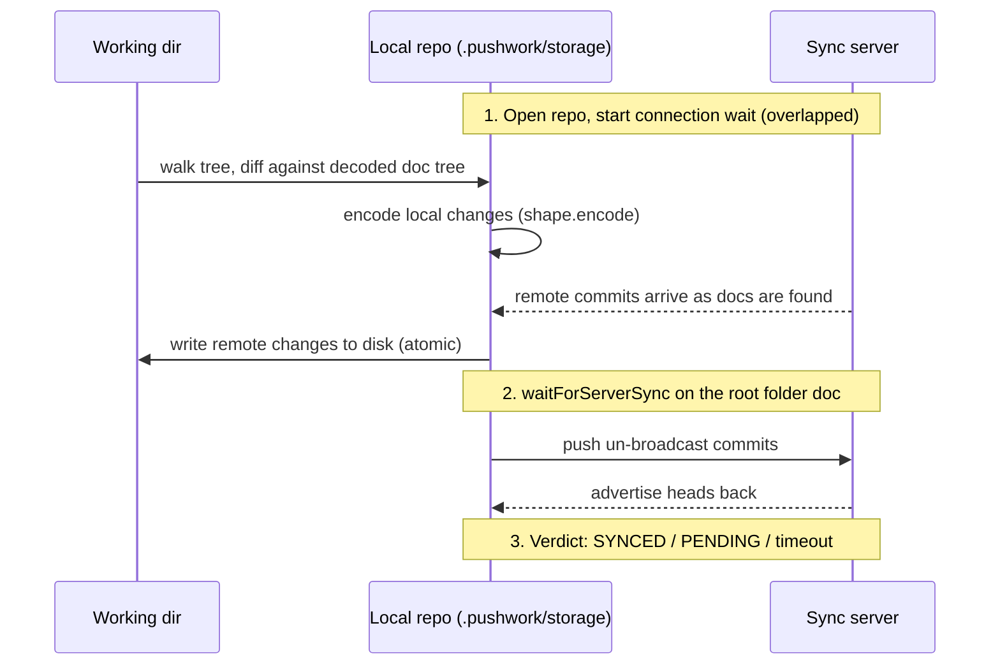

# Sync

## Flow

`pushwork sync` is a commit + reconcile against the sync server:



Key properties:

- `repo.find` is what triggers delivery — every file leaf is touched so the network layer announces it to peers.
- The connection wait (`waitForConnection`) starts immediately after `openRepo` so local tree work overlaps the Subduction handshake.
- Big fresh clones/ingests shard across worker threads (`ingest-pool.ts`) past a size threshold.

## The Sync Verdict

The CLI must not claim SYNCED unless the server demonstrably has our data. `syncVerdict` (in `repo.ts`) judges against the _server's_ advertised state, not a local-settle heuristic:

| Condition | Meaning |
| --- | --- |
| _local-quiet_ | Our heads haven't changed for `idleMs` (local writes flushed) |
| _pull-complete_ | We hold every commit the server advertised (`containsHeads`) |
| _push-confirmed_ | The server advertised our current frontier back to us |

```
SYNCED  = local-quiet ∧ pull-complete ∧ push-confirmed
PENDING = local-quiet ∧ pull-complete ∧ ¬push-confirmed
```

> [!NOTE]
>
> Server heads are Subduction _sedimentree_ heads (loose-commit and fragment-boundary ids), NOT the Automerge frontier — they are never compared to `handle.heads()` for equality. Pull-completeness asks "do we already contain everything advertised?"; push-confirmation asks "is our frontier a subset of what the server advertises?".

### Known false negative

A server that compacts our change into a fragment may re-advertise it under a different id, so push-confirmation fails and the CLI shows PENDING even though the data landed. This is deliberate — a conservative false-PENDING replaced the old false-SYNCED. Only a server-ack (`awaitSynced()`-style) API in automerge-repo closes the gap completely.

### Stuck-doc nudge

If we're behind for `resyncAfterMs` (default 6 s) and the scheduler isn't catching us up, `waitForServerSync` re-arms a single fresh sync round via `repo.resyncSubduction(documentId)` — once per document per run (`claimResync`).

## Backends

| Backend | Selection | Verdict basis |
| --- | --- | --- |
| Subduction (default) | unflagged | server-advertised heads (above) |
| Legacy WebSocket relay | `--legacy`/`--no-sub` | local head-stability settle only |

The backend is persisted per-repo in the config; both share the same `automerge-repo` API surface.

## Offline Commands

`save`, `status`, `diff`, `heads`, `cut`/`paste`, and `nuclearizeRepo` open the repo offline (`openRepo(..., { offline: true })`) and never contact the server; the next online `sync` publishes whatever they produced.
