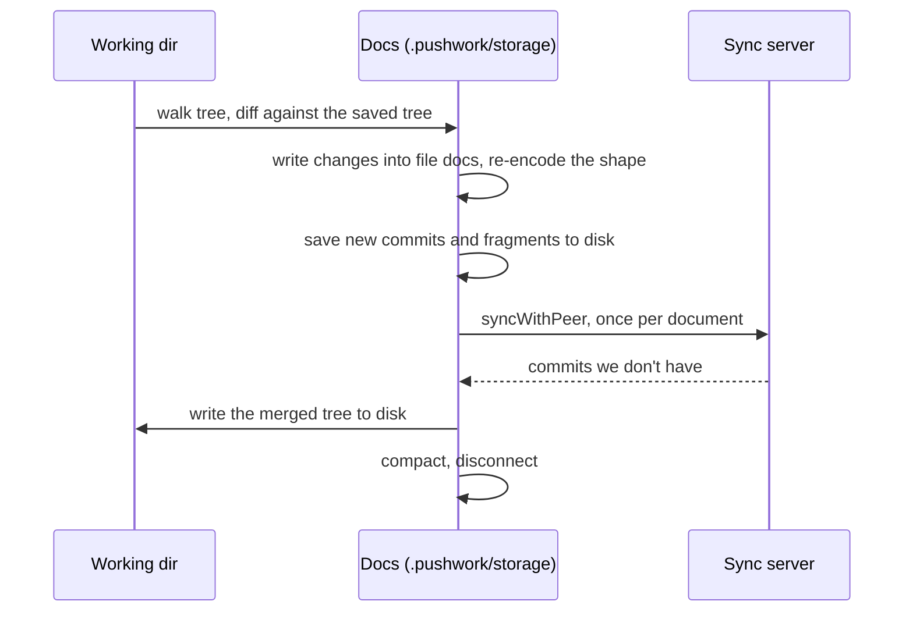

# Sync

pushwork runs one Subduction node per command (`src/docs.ts`). Documents are loaded from `.pushwork/storage`, changed in memory, saved back, and synced with the server one document at a time. Nothing is kept between commands except what is on disk.

## Flow

```mermaid
sequenceDiagram
    participant W as Working dir
    participant D as Docs (.pushwork/storage)
    participant S as Sync server

    W->>D: walk tree, diff against the saved tree
    D->>D: write changes into file docs, re-encode the shape
    D->>D: save new commits and fragments to disk
    D->>S: syncWithPeer, once per document
    S-->>D: commits we don't have
    D->>W: write the merged tree to disk
    D->>D: compact, disconnect
```

The steps of `sync`, in order (`commitWorkdir` in `src/pushwork.ts`):

1. Decode the saved tree. This is local: we diff against the last local state, not the remote one.
2. Walk the working directory and write changed files into their docs.
3. If the tree changed, re-encode it into the root.
4. `docs.sync()`: save, then sync every document this run has loaded (the whole tree).
5. If artifact pins moved during the sync, sync the folders that hold them again.
6. Decode the tree again and write it to disk. Documents it references that we don't have yet are fetched as they are found.
7. Close: save, compact, disconnect.

`save` is the same pipeline offline, stopping after step 3 and materializing.

## The verdict

A document is synced when one `syncWithPeer` round sends nothing and receives nothing. pushwork tries up to six rounds per document. A server that keeps asking for data it never accepts (a write it refuses) never reaches a quiet round.

The server only counts a commit as held once its storage write has finished, so the round after we send can ask for the same commit again. After a round where we only sent, pushwork waits before the next one: 50ms, doubling each time, about 1.5s in all before it gives up.

| Verdict | Condition |
| --- | --- |
| `OFFLINE` | The connection failed. |
| `SYNCED` | Every document reached a quiet round. |
| `PENDING` | At least one didn't. |

The server's heads are sedimentree heads (loose commits and fragment boundaries), not the Automerge frontier, so they are never compared with local heads.

## Storage and compaction

Each document is a sedimentree: loose commits plus fragments that cover runs of history. `save` writes the commits and fragments Automerge reports that aren't on disk yet. On close, every document that was saved or received data this run is compacted: blobs on disk that the live fragment set no longer needs are deleted, provided everything in that set is already on disk.

The current server doesn't compact, so after a client compacts, the next sync may receive the old loose commits again. The result is still correct; it costs bandwidth on documents with long histories.

## Offline commands

`save`, `status`, `diff`, `heads`, `cut`, `paste` and `snarfs` never open a connection. The next `sync` publishes whatever they produced.
