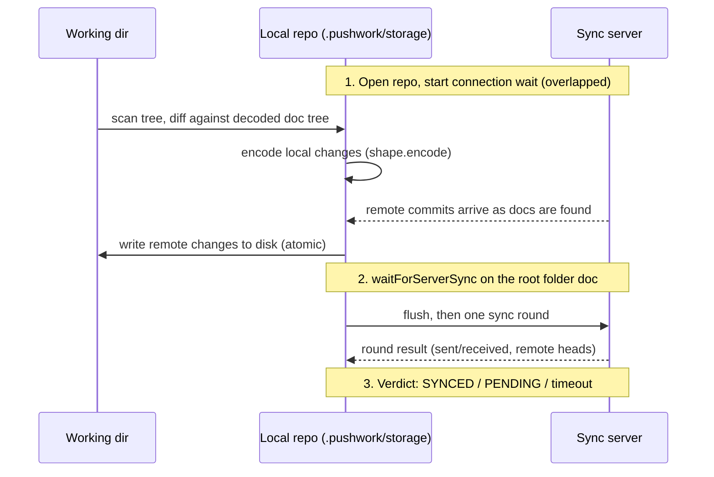

# Sync

## Flow

`pushwork sync` is a commit + reconcile against the sync server:


```mermaid
sequenceDiagram
    participant W as Working dir
    participant L as Local repo (.pushwork/storage)
    participant S as Sync server

    Note over L,S: 1. Open repo, start connection wait (overlapped)
    W->>L: scan tree, diff against decoded doc tree
    L->>L: encode local changes (shape.encode)
    S-->>L: remote commits arrive as docs are found
    L->>W: write remote changes to disk (atomic)
    Note over L,S: 2. waitForServerSync on the root folder doc
    L->>S: flush, then one sync round
    S-->>L: round result (sent/received, remote heads)
    Note over L,S: 3. Verdict: SYNCED / PENDING / timeout
```

Key properties:

- `repo.find` is what triggers delivery — every file leaf is touched so the network layer announces it to peers.
- The connection wait (`waitForConnection`) starts immediately after `openRepo` so local tree work overlaps the Subduction handshake.
- Document fan-out (`repo.find` per leaf) is uncapped: one Subduction connection multiplexes the round-trips and the transport's receive-credit windowing is the backpressure. Filesystem fan-out _is_ capped (`pool.ts`), because unbounded reads exhaust file descriptors.

## The Scan

`scanWorkdir` compares the working tree to the doc tree. Neither side is read in full: `.pushwork/stat-cache.json` records, per path, the filesystem identity of the bytes (`size`, `mtimeNs`, `ctimeNs`, `ino`) and the file doc's heads at the last moment the two were confirmed equal. A path whose stat signature _and_ heads both still match is known-unchanged without reading the file or decoding the document.

Both halves are load-bearing: heads alone would miss a local edit, a stat signature alone would miss an edit that arrived from a peer. Anything unknown, mismatched, or written within the same timestamp tick as the cache (git's "racily clean") falls back to a full byte comparison, so a stale or absent cache costs speed and never correctness.

## The Sync Verdict

The CLI must not claim SYNCED unless the server demonstrably has our data. `waitForServerSync` asks Subduction rather than inferring: `repo.flush` drains the document's pending changes into its sedimentree, then `syncWithAllPeers` runs one round and returns a `PeerBatchSyncResult`.

```
SYNCED  = round.success ∧ pull-complete
PENDING = round.success ∧ ¬pull-complete
```

A successful round means the server took our commits — that _is_ push confirmation, so there is nothing left to infer. Pull-completeness is still a `containsHeads` check against `stats.remoteHeads`, polled briefly because commits received in the round are applied to the document off the call stack.

### Fallback: advertised heads

When the document can't be located in Subduction — nothing written to it yet, or the DocumentId → SedimentreeId mapping (which upstream marks temporary) has moved — `pollForServerSync` takes over with the older, weaker inference:

| Condition | Meaning |
| --- | --- |
| _local-quiet_ | Our heads haven't changed for `idleMs` (local writes flushed) |
| _pull-complete_ | We hold every commit the server advertised (`containsHeads`) |
| _push-confirmed_ | The server advertised our current frontier back to us |

> [!NOTE]
>
> Server heads are Subduction _sedimentree_ heads (loose-commit and fragment-boundary ids), NOT the Automerge frontier — they are never compared to `handle.heads()` for equality.

This path keeps the known false negative: a server that compacts our change into a fragment re-advertises it under a different id, push-confirmation fails, and the CLI shows PENDING for data that landed. The direct route above is not subject to it.

### Stuck-doc nudge

If the fallback is behind for `resyncAfterMs` (default 6 s) and the scheduler isn't catching us up, it re-arms a single fresh sync round via `repo.resyncSubduction(documentId)` — once per document per run (`claimResync`).

## Backends

| Backend | Selection | Verdict basis |
| --- | --- | --- |
| Subduction (default) | unflagged | Subduction sync round; advertised heads as fallback |
| Legacy WebSocket relay | `--legacy`/`--no-sub` | local head-stability settle only |

The backend is persisted per-repo in the config; both share the same `automerge-repo` API surface.

## Offline Commands

`save`, `status`, `diff`, `heads`, `cut`/`paste`, and `nuclearizeRepo` open the repo offline (`openRepo(..., { offline: true })`) and never contact the server; the next online `sync` publishes whatever they produced.
